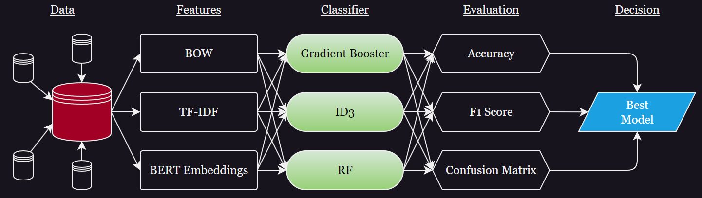

# Genre Classifier: A Machine Learning Approach to Text Classification

This repository contains a project focused on **text classification** to predict the genre of a given text. The primary goal of this project is to build a robust and efficient machine learning pipeline that processes textual data and accurately assigns genres.

The project includes:
- **Preprocessing Techniques**: Text vectorization using methods like Bag of Words (BOW), TF-IDF, and contextual embeddings like BERT.
- **Model Implementation**: Utilized Random Forest Classifier, ID3 and Gradient Boosting Classifier for baseline evaluations.
- **Evaluation Metrics**: Accuracy, F1-Score, and visualizations using confusion matrices to assess model performance.

Explore the detailed workflow, dataset, and code to replicate or extend this study!

## Workflow Diagram

Below is the visual representation of the workflow for this project:

## Explanation of the Workflow

The process for genre classification involves the following steps:

1. **Dataset Collection**: 
   - Gathered textual data with labeled genres.
   - Genres: [Education, Finance, Politics, Sports].

2. **Data Preprocessing**: 
   - Cleaned and tokenized text data.
   - Applied feature extraction techniques:
     - Bag of Words (BOW)
     - Term Frequency-Inverse Document Frequency (TF-IDF)
     - Contextual embeddings using pre-trained BERT.

3. **Model Training**:
   - Experimented with Random Forest Classifier, Gradient Boosting Classifier and Decision Tree Classifer.
   - Conducted training for each feature extraction method to identify the best-performing approach.

4. **Model Evaluation**:
   - Evaluated the model's performance using:
     - Accuracy
     - Weighted F1-Score
     - Confusion Matrix
   - Compared results across feature extraction techniques to identify the optimal solution.

5. **Result Visualization**:
   - Generated visualizations for confusion matrices.
   - Tabulated and plotted Accuracy and F1-Scores for better interpretability.

6. **Conclusion**:
   - Finalized the best feature extraction technique and its corresponding performance metrics.

## Dataset Links

The dataset used in this project can be accessed here:
- [Dataset 1: Kaggle Text Genre Dataset](<https://www.kaggle.com/datasets/prishasawhney/sentiment-analysis-evaluation-dataset>)

